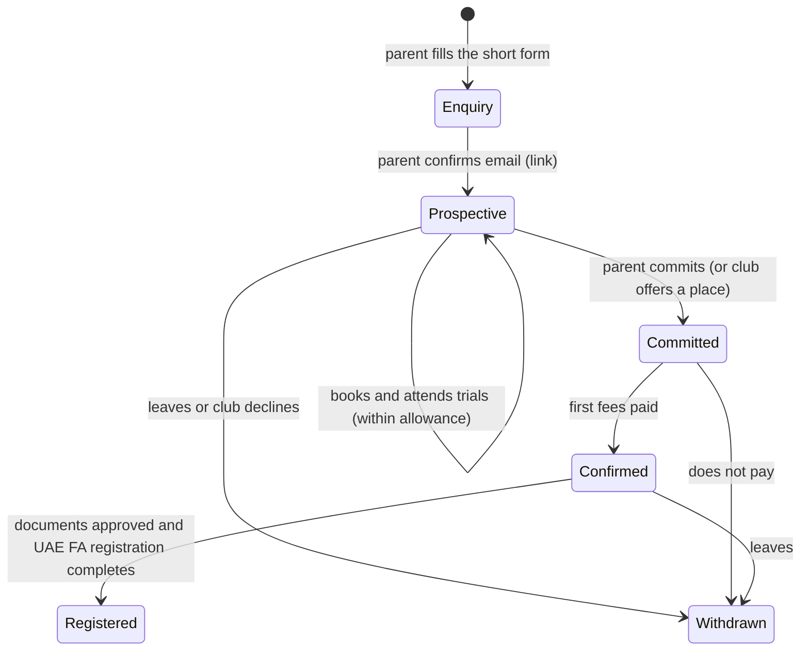
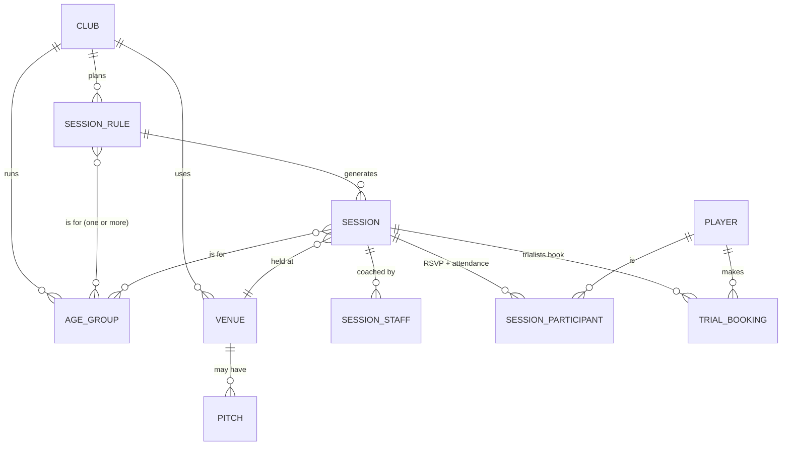

# MVP plan v0.4: Trials, Registration and Scheduling (for review, no SQL yet)

> **Note (v0.7):** scope is now defined in [PILOT_SCOPE.md](PILOT_SCOPE.md). Payments and the gateway are a later build; the reviewer role is assignable; a person is an "athlete" underneath. Where this file differs, PILOT_SCOPE.md and DECISIONS.md win.

Status: **PLAN ONLY. Nothing here is approved.**
Adds to, and where they differ overrides, [SCHEMA_PLAN.md](SCHEMA_PLAN.md) v0.2. Decisions are logged in [DECISIONS.md](DECISIONS.md).

**Inputs received and used** (transcribed, not copied, under `docs/reference/`):
* [UAE FA youth registration requirements 2026/27](reference/UAEFA_YOUTH_REGISTRATION_2026_27.md), from Fursan
* [Fursan weekly training schedule 2026/27](reference/FURSAN_SCHEDULE_2026_27.md), from Fursan

---

## 1. The product in one paragraph

A parent does the whole journey alone: **enquire → book a trial → commit and pay → upload documents → see what is still missing → book the medical → follow the schedule.** The manager builds the club's week in minutes with drag and drop. Coaches are not in the registration loop; they see who is coming and can invite a trialist back. The selling point is time saved: fewer WhatsApp questions, fewer rejected UAE FA submissions.

## 2. The parent's lifecycle, and what we hold at each stage

The rule you gave: **ask for very little first, ask for the documents only after commitment and payment.** The database enforces it; a screen cannot skip it.



| Stage | What the parent gives | What is blocked |
|---|---|---|
| **Enquiry / Prospective** | Only: parent name, phone, WhatsApp, email; child name, date of birth, position they plan to play | Documents, photo, ID numbers, medical, payments. The database refuses to store them |
| **Committed** | Accepts the club's terms and the place; sees the fee to pay | Documents still blocked |
| **Confirmed** (fee paid) | Everything registration needs: Emirates ID, passport, birth certificate, photo, residence details, and so on (section 7) | Nothing further blocked |
| **Registered** | Nothing new. Status of the UAE FA/FIFA submission | |

Not-converted prospects are **deleted automatically after a set time** (proposed 90 days).

**Consent, in two steps (a change to v0.2, which had one):**
1. *Trial consent* is the email link the parent clicks to confirm their address. It covers only the short prospect record and trial communications.
2. *Membership and registration consent* is given at commitment. It covers documents, photo, medical information, and **sharing with the clinic and with UAE FA/FIFA**, listed separately so a parent can see each purpose.

WhatsApp: the number is stored as its own field, and the parent opts in to WhatsApp messages separately. Sending through WhatsApp comes later; email works from day one.

---

## 3. What is in the MVP

| In MVP | Foundation only (exists, little or no screen) | Later |
|---|---|---|
| Club settings: tournaments, age groups, trial policy, block grid | Roles, permissions, club walls, row-level security | Full fee plans, instalments, refunds |
| **Schedule builder** and colour calendar | Consent and the child-data gate | Coach ratings, drills, streaks |
| **Enquiry, trials, allowance, invites** | Notifications outbox | Messaging and reporting |
| Prospective → Confirmed → Registered | Audit log, self-serve deletion | Photo galleries, video |
| **UAE FA registration**: rules by category, document checks, medical, pack | Match sheets, deadlines, fines data | Staff HR files |
| **Joining fee and payment recording** (the gate to Confirmed) | | FANet.ae automation |
| Parent home and club information pages | | AI photo enhancement |

**Payment is in the MVP, including the online gateway** (your decision after v0.4): paying is what makes a prospect a member, and after the free trials a parent can book and pay for an extra class online. Staff can also record POS payments taken on site. Lead management and coach communication are planned in [LEADS_PLAN.md](LEADS_PLAN.md); that plan supersedes the "trial booking" and "notifications" details here.

---

## 4. Foundation changes (the "don't redo it later" list)

| # | Change | Why |
|---|---|---|
| F1 | **Age group is its own thing, defined by birth years**, above squads. Names follow the rule *U-number = season end year minus birth year* (2027 − 2017 = U10). A group can span two birth years (U5/U6 = 2021 and 2022; U18 = 2010 and 2009), and a group can be custom, with no birth year (**"2nd Team"**). | Straight from Fursan's calendar |
| F2 | A **squad** (e.g. "U12 A") is a team inside an age group, used for matches. Clubs with one team per group see no difference. | Keeps matches from v0.2 |
| F3 | **A session can belong to several age groups.** v0.2 allowed one squad per event. | Blocks like Tuesday 5:00 with five groups |
| F4 | **Recurring rules with date ranges** create the dated sessions. Change "from this week on" ends one rule and starts another. One-off edits never touch the series. | "Combined in weeks 1-2, split later" |
| F5 | **Player has two separate statuses:** *data status* (consent gate) and *club relationship* (enquiry, prospective, committed, confirmed, withdrawn, alumni). v0.2 mixed them. | Prospects are children too |
| F6 | **Data stage gate.** A table or field is only allowed at a stage. Documents need *Confirmed* plus registration consent. | "Very little first" |
| F7 | **Tournaments are a club setting.** A player has **one registration per tournament per season**, and may be in several. | Multiple age groups and tournaments |
| F8 | **Documents belong to the person they identify** (child, mother, father), not to a registration. A registration points at documents that satisfy its rules, so one upload serves several tournaments. | UAE FA asks for the mother's and father's papers |
| F9 | **Guardians are labelled mother / father / other**, because rules name them. | Rules table |
| F10 | **Player category** (Local Player, UAE Child, UAE Born, Resident > 5 years, Resident < 5 years) is a stored fact, worked out from short questions and confirmed by staff. | It selects the document list |
| F11 | **Requirements come from a rules table, not code.** Lines can be a bundle (5-years proof), either-or (rent contract or title deed), multi-part (Emirates ID front and back), or a club form to sign (father adoption form). | The real Fursan table needs all four |
| F12 | **Requests outside the table:** staff can add a one-off requirement to one child ("UAE FA asked for X"). | Source says extra documents may be requested any time |
| F13 | **Registration has its own pipeline** including *submitted to UAE FA* and *waiting on federation/FIFA* (3-4 weeks). | Lead time must drive reminders |
| F14 | **Coach is removed from registration.** Registration actions belong to the parent and to Manager/Admin (a "registrar" permission). | Your goal |
| F15 | **Payment is a foundation piece, not "later":** a fee, a charge per child, and a payment record that flips Committed → Confirmed. | Your lifecycle |

---

## 5. Club settings added

| Setting | Example | Notes |
|---|---|---|
| Tournaments the club plays | UAE National League, DOFA, YFL | From platform templates; per season |
| Age groups | U5/6 to U18, 2nd Team | Birth years, calendar colour, default session length |
| Block grid | 5:00-6:30, 6:30-8:00, 8:00-9:30 | Fixed blocks the schedule snaps to. Optional: free-form clubs can skip it |
| Trial policy | 1 free trial, or up to 5 | Club default, overridable per age group. More only by coach invitation |
| Joining fee | amount per age group | Payment makes the child Confirmed |
| Club registration contact | email, name | Receives alerts; queries go here, not to coaches |
| Assigned clinic | name, email | The source calls it "assigned clinic" |
| Club forms | Father adoption form | Club uploads the template; parent downloads, signs, uploads |
| Club colours | primary, secondary | Calendar now; photo frame later |
| Lead time per tournament | 28 days | Reminders count back from the league deadline |

---

## 6. Trials

* **Public club page** with a short enquiry form: the seven fields in section 2. The club shares the link. No account password: the parent confirms by email link and gets a magic-link login.
* **Booking:** the parent picks from published trial sessions for the child's age group (worked out from date of birth; the parent may also request an older group). Optional capacity and waiting list.
* **Allowance:** club default (1 or 5), overridable per age group. The parent sees "1 of 5 used". When used up: "Ask the coach". The coach has one tap to **invite** more, with a reason and a number.
* **Counting rule:** to decide (question 3).
* **Information without asking:** trial times, what to bring, how registration works, and fees appear on the prospect's home screen and in a public FAQ.
* **Conversion:** after trials, the parent taps "Join" (or the club offers a place); they accept terms, see the fee, pay, and become Confirmed.

---

## 7. UAE FA registration

### 7.1 How it works

```
Short questions  ->  Player category  ->  Rules table  ->  Personal checklist  ->  Checks  ->  Pack  ->  Submit
(UAE national?       (one of five)        (document ×         "You need 10          (auto,      (named        (club sends to
 born in UAE?                              category ×          documents, 4 done"     then       as UAE FA     UAE FA / FIFA,
 years resident?)                          holder)                                    human)     wants)        3-4 weeks)
```

**Guided questions** replace the jargon. Example: *Is your child a UAE national? Was your child born in the UAE? How long has your child lived in the UAE?* The answer gives a category. Staff confirm it (a wrong category means a wrong document list). Exact placement rules are in question 2.

### 7.2 The real rules table (Fursan, 2026/27)

Holder: **P** player, **M** mother, **F** father. Full detail in [the reference file](reference/UAEFA_YOUTH_REGISTRATION_2026_27.md).

| Document | Holder | Local | UAE Child | UAE Born | Res > 5 | Res < 5 |
|---|---|:-:|:-:|:-:|:-:|:-:|
| Emirates ID, front and back | P | ✓ | ✓ | ✓ | ✓ | ✓ |
| Passport | P | ✓ | ✓ | ✓ | ✓ | ✓ |
| Medical report (assigned clinic) | P | ✓ | ✓ | ✓ | ✓ | ✓ |
| Birth certificate | P | | ✓ | ✓ | ✓ | ✓ |
| Emirates ID, front and back | M | | ✓ | | | |
| Passport | M | | ✓ | ✓ | ✓ | ✓ |
| Passport | F | | ✓ | ✓ | ✓ | ✓ |
| Family Book or UAE-nationality document | family | | ✓ | | | |
| Residence visa | P | | | ✓ | ✓ | ✓ |
| 5-years proof (visas + KHDA school history) | P | | | ✓ | ✓ | |
| Continuation studies certificate (this year) | P | | | ✓ | ✓ | ✓ |
| Father adoption form (club form) | F | | | ✓ | ✓ | ✓ |
| Father work contract and validation | F | | | | | ✓ |
| Rent contract **or** title deed | family | | | | | ✓ |
| **Total documents** | | **3** | **8** | **10** | **10** | **11** |

The table is data: the club (or we, as a platform template) can change a row, add a category, or add DOFA and YFL lists without a code change. Each registration keeps the rules version it opened under, and the club sees "rules updated, review" when the template changes.

### 7.3 Automation ladder
Each rung works without the next, so the low-risk ones ship first.

| Rung | What happens | Risk |
|---|---|---|
| 1. Personal checklist | The parent sees exactly what *their* child needs, who the document is about, with an example and a reason | None |
| 2. Automatic file checks | Format (PDF/JPG/PNG), legibility, both sides of the Emirates ID present, expiry dates entered by the parent (visa, passport, ID), "this year" for the continuation certificate, name and date of birth against the profile | Low |
| 3. Human review queue | Admin approves or rejects with a stock reason; the parent is told what to fix | Low |
| 4. Reminders | Email nudges to the parent counted back from the deadline. Coach never involved | Low |
| 5. Medical booking | See 7.4 | Medium |
| 6. Registration pack | One download per child with approved documents **named the way the club asks** (`Robert.Passport.pdf`). Replaces the parent's "one email with everything" | Low |
| 7. Reading documents (OCR/AI) and AI photo enhancement | Extract names and dates; recolour photos in club colours | **High**, see 7.5 |

### 7.4 Medical fitness

```
Parent taps "Book medical" -> platform emails the assigned clinic (first name, age, parent contact via the platform)
-> clinic opens a one-time secure link and offers 2-3 slots -> parent picks one -> confirmations to both
-> clinic (or parent) uploads the report -> admin check
```

* The clinic does not need an account. A one-time link is far more dependable than reading email replies.
* Only the minimum goes to the clinic. **The parent agrees first**, because health information about a child goes to a third party (the second consent step in section 2).
* No answer in N days: reminder to the clinic, then a message to the club's registration contact.

### 7.5 AI features, honestly
Reading documents and enhancing photos both send children's photos and ID documents to an AI service. That needs extra consent wording, a data-processing agreement, a check on where the vendor stores data (you chose Frankfurt), and deletion that covers the vendor. Achievable, but not in the first release. Proposal: rungs 1-6 first, with non-AI photo checks. Rung 7 is its own phase after counsel approves. The schema keeps room: each check records *how* it was done and *by whom*.

### 7.6 Registration pipeline
`Not started → Collecting documents → Ready for club review → Needs fixes → Approved → Submitted to UAE FA → With UAE FA/FIFA (expected in 3-4 weeks) → Registered` (or `Queried by UAE FA`, which reopens with the extra request).
The dashboard groups by these, so the registrar sees "12 waiting on parents, 5 ready to review, 8 with UAE FA".

### 7.7 Sketches

**Parent: short enquiry form**
```
+--------------------------------+
| Fursan Hispania · Trial request|
| Your name        [___________] |
| Phone            [___________] |
| WhatsApp  [x] same as phone    |
| Email            [___________] |
| Child's name     [___________] |
| Child's birth date [__/__/____]|
| Position they'd like to play   |
|  ( ) Goalkeeper ( ) Defender   |
|  ( ) Midfielder ( ) Forward    |
|  ( ) Not sure                  |
| [ Send request ]               |
| We'll email a link to confirm. |
+--------------------------------+
```

**Parent: registration checklist, after payment**
```
+--------------------------------+
| Omar · U11 · Resident > 5 years|
| Registration  4 of 10 done     |
| [####---------]                |
+--------------------------------+
| [OK] Omar's passport           |
| [OK] Omar's Emirates ID        |
| [OK] Birth certificate         |
| [!]  5-years proof             |
|      Visas covering 5 years    |
|      + school history (KHDA).  |
|      [Upload] [What is this?]  |
| [ ]  Father's passport         |
|      [Upload]                  |
| [ ]  Mother's passport         |
| [..] Medical  clinic offered   |
|      3 times [Choose a time]   |
| [ ]  Father adoption form      |
|      [Download] [Upload signed]|
+--------------------------------+
| Submit by 14 Oct (UAE FA takes |
| 3-4 weeks). Reminder in 2 days.|
+--------------------------------+
```

**Registrar: one queue**
```
Registrations    Tournament [UAE National League v]   Age group [All v]
 Waiting on parents 12 | Ready to review 5 | Submitted 8 | Registered 31
 Omar Al-H.   U11  Res>5   7/10   waiting: Father passport    [Remind] 
 Yousef A.    U9   Born    10/10  ready to review             [Review]
 Khalid N.    U13  Child   8/8    ready for pack              [Build pack]
```

---

## 8. Schedule

### 8.1 The real example
Fursan's week is a grid of **3 blocks × 5 days = 15 cells**, holding 13 groups, 3 sessions each (39 group-sessions). Today it is a picture. See [the reference file](reference/FURSAN_SCHEDULE_2026_27.md).

### 8.2 The idea
Draw the week once, by dragging age groups into cells. The system turns it into dated sessions, colours it by age group, warns about clashes, and tells parents.



A rule = weekday + start + end + venue (+ pitch) + age groups + valid from/until. A block cell simply means "start and end snap to the block".

### 8.3 What managers will do
Editing a session asks one question: **only this session / this and all following / all sessions in this rule.**
* **Draft vs published:** parents see only published sessions; publishing sends one summary per family.
* **Clash warnings, not blocks:** same pitch overlapping, a coach in two places, an age group in two places, outside opening hours. The manager can override with a note.
* **Cancelled or moved** sessions keep their history, notify those affected, and give trialists their allowance back.
* **Pre-season merge:** put U10 and U11 in one cell for weeks 1-2, then press "Split from week 3".
* **Copy last week**, **repeat until**, and a **phone-calendar feed** for parents and coaches.
* Times are stored in UTC and shown in the club's time zone.

### 8.4 Sketch: builder, with Fursan's data

```
+------------------------------------------------------------------------------------------+
| Schedule  Zayed venue [v]  Week of 12 Oct [<][>]  Draft  [Copy last week]  [Publish]     |
+---------------------+--------------------------------------------------------------------+
| AGE GROUPS (drag)   |            Mon      Tue        Wed       Thu        Fri            |
| [U5/6 ][U7 ][U8 ]   | 5:00-6:30  U10 U11  U5/6 U7    U10 U11   U5/6 U7    U5/6 U7        |
| [U9 ][U10][U11]     |                     U8 U9 U12  U12       U8 U9      U8 U9          |
| [U12][U13][U14]     |                                          U10 U11    U12            |
| [U15][U16][U18]     | 6:30-8:00  U14 U13  U15 U16    U14 U13   U15 U16    U13 U14        |
| [2nd Team]          | 8:00-9:30  2nd U18  U18        U15 U16   U18 2nd    (empty)        |
|                     |                                2nd                                 |
| Each group: 3/wk    +--------------------------------------------------------------------+
|  U10  3 of 3  ok    | Each chip is a coloured age-group tag. Drag to move; drop on a     |
|  U12  2 of 3  !     | filled cell to combine; click a chip for "only this / from here /  |
|  U18  3 of 3  ok    | all", coach, pitch.                                                |
+---------------------+--------------------------------------------------------------------+
| ! Clash: Coach Hamad is on U13 and U11 Mon 5:00-6:30                    [Fix] [Ignore]     |
+------------------------------------------------------------------------------------------+
```
The side panel shows **sessions per week per group** ("3 of 3"), which is how Fursan plans.

### 8.5 Sketch: parent view (phone)
```
+--------------------------------+
| Schedule   Omar (U11)          |
| THIS WEEK                      |
| Mon 5:00-6:30  Training        |
|  [ Going ]  [ Can't go ]       |
| Wed 5:00-6:30  Training        |
| Thu 5:00-6:30  Training   NEW  |
| NEXT WEEK: Thursday moves to   |
| 6:30 pm                        |
| [ Add to my phone calendar ]   |
+--------------------------------+
```

---

## 9. Data model additions (plain language)

| Area | New tables | Purpose |
|---|---|---|
| Setup | `age_groups`, `block_grid`, `club_tournaments`, `trial_policies`, `pitches`, `club_forms` | Settings above |
| Schedule | `session_rules`, `session_rule_groups`, `sessions`, `session_groups`, `session_staff`, `session_participants` | Recurring plan becomes dated sessions |
| Lifecycle | `enquiries`, `trial_bookings`, `trial_invites`; `players` gets club relationship + stage | Prospect → Confirmed |
| Player facts | `players`: position wanted, birth country, nationalities, residency, school, **registration category**; guardians: mother/father/other, WhatsApp number and opt-in | Rules inputs |
| Consent | consent purposes: trial, membership, medical-and-clinic, federation sharing, photo | Two-step consent |
| Requirements | `tpl_document_types`, `tpl_categories`, `tpl_requirements` (with alternatives, bundles, holder, validity), `registrations`, `registration_requirements`, `registration_extra_requests` | The rules table and each child's checklist |
| Documents | `person_documents` (child, mother, father), with file parts, type, dates entered, replaced-by; `document_checks` | Reusable, checked, auditable |
| Medical | `clinics`, `fitness_requests`, `fitness_slot_offers`, `clinic_links` | Clinic workflow |
| Money (minimum) | `fee_plans`, `charges`, `payments` | Committed → Confirmed |
| Output | `registration_packs`, `submissions` (to UAE FA: date, reference, response) | Pack and tracking |

All v0.2 rules stay: club wall on every row, row-level security everywhere, consent gate on everything about a child. **Parents' own documents (Emirates ID, passport, visa, contracts) are adult personal data too** and get the same tight access as medical: the parent, and Manager/Admin with the registrar permission. Deletion requests remove them.

---

## 10. Questions I need answered (most important first)

1. **Payment in the MVP.** Paying makes a child Confirmed. Do you want: (a) staff mark it paid at first (cash/bank transfer), online card/wallet right after, or (b) online payment from day one? This decides when we must choose the gateway.
2. **Category placement.** How is a child placed into *Local Player*, *UAE Child*, *UAE Born*, *Resident > 5*, *Resident < 5*? My guess: Local = UAE national; UAE Child = child of a UAE-national mother with a foreign father (because the list wants the mother's Emirates ID and the Family Book); the rest by birth place and years resident. Is that right, and is there a priority order?
3. **Trial counting.** Does the allowance count per booking or per attendance? Per child, or per age group? Do no-shows count?
4. **Who triggers Committed.** Does the parent choose to join after trials, or does the club offer a place first (or both)?
5. **Father adoption form.** What is it, and can you share the blank form so we can host it? Who signs?
6. **Photo.** The Fursan list has no player photo, but you mentioned one earlier. Is a photo required by UAE FA, and does it have a specification you want checked?
7. **Expiry rules.** Any minimum validity for passport, Emirates ID and visa (for example six months)? Is the "5-years proof" a single file or several?
8. **Blocks and pitches.** In one block, do groups share a pitch or use separate ones? Do you want to schedule individual pitches, or only the venue? And are weekend matches part of the schedule MVP?
9. **Submission to UAE FA.** After the club approves, how does the club submit (email, portal)? Should the pack be emailed by the platform to the club's registration inbox, as Fursan does today?
10. **Still open from before:** delete non-converted prospects after 90 days? Non-AI photo checks first, AI later?
