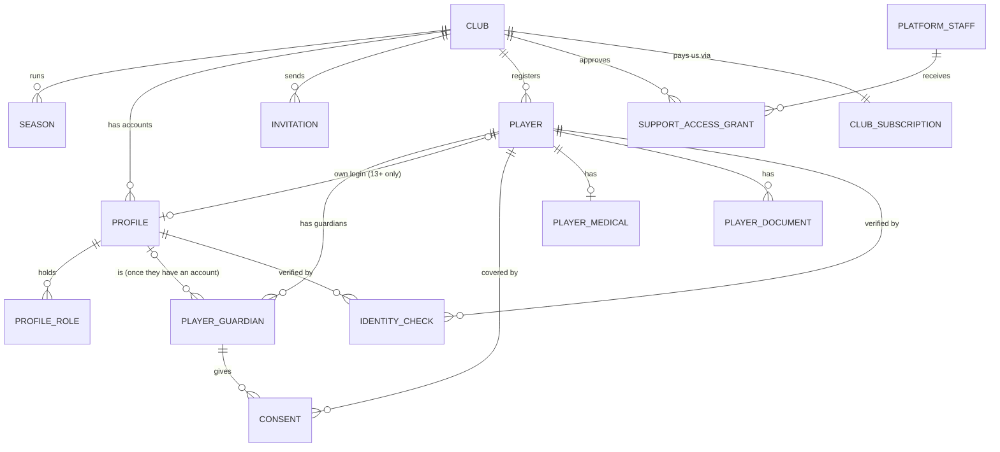
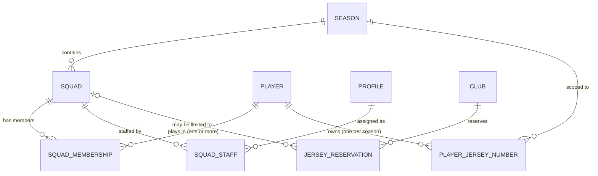
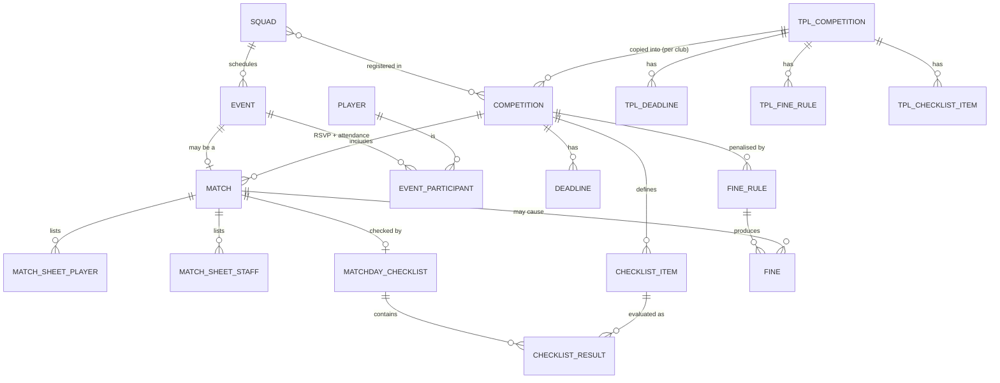
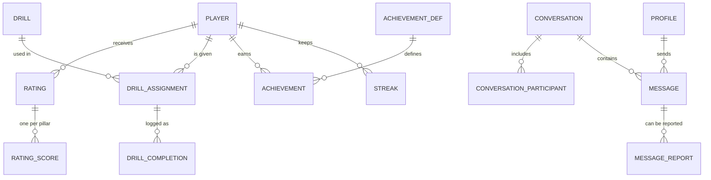
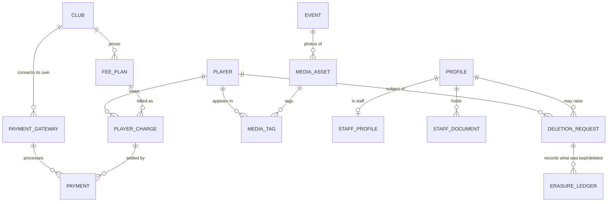
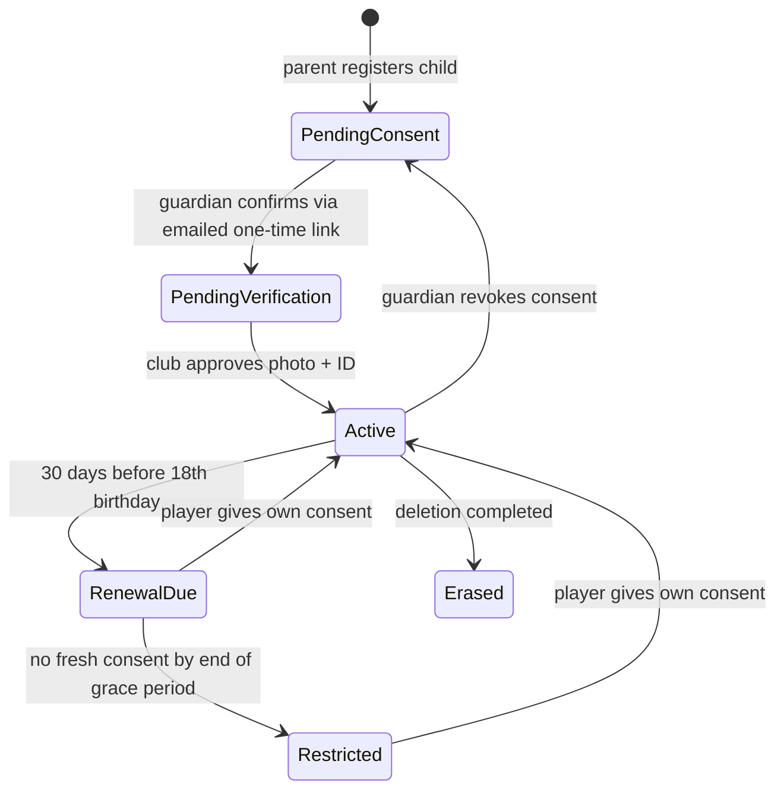

# Schema plan (v0.1, for review, no SQL yet)

Status: **PLAN ONLY. Nothing here is approved.** The SQL is written after you approve this document.
Decisions this plan relies on are in [DECISIONS.md](DECISIONS.md).

---

## 1. Design principles

1. **One database, many clubs.** Every club-owned row carries a `club_id`. The database (not only the app) blocks any row from pointing at another club's data.
2. **Row-level security on every table.** No table is readable or writable "by default".
3. **Children are a hard rule, not a feature.** For anyone under 18, *no personal data is processed until a guardian's consent is verified* (see section 4).
4. **Small role set, many permissions.** A person holds a *set* of roles (a small-club owner can be Manager + Admin + Coach). Roles map to fine-grained permissions in a table, so Manager and Admin are separate permission levels, not one hardcoded role.
5. **Money is whole numbers of the currency's smallest unit** (e.g. fils for AED, cents for EUR). Never decimals or floats. Every money row also stores its **currency code**, so history stays correct if a club changes currency later.
6. **Built for clubs worldwide.** Currency, country, time zone, tax label, weekend days and age-of-consent are **club settings** (defaults: AED, UAE, Asia/Dubai, 18). The app is English-only at launch; Arabic appears only in a few optional fields where a league asks for it (e.g. a player's name in Arabic for UAE FA registration). Times are stored in UTC and shown in the club's time zone.
7. **Messages are append-only.** Nothing is edited or deleted in place, so reports keep their evidence. Moderators *hide*; they do not delete.
8. **No leaderboards.** There is deliberately no table or view that ranks children against each other.
9. **Secrets never live in tables.** Payment-gateway keys go in Supabase Vault; tables keep only a reference to them.

---

## 2. Entity diagrams

Diagrams show entities and relationships only (no columns). They render on GitHub and in most Markdown viewers.

### 2.1 Clubs, accounts and people

### 2.2 Squads and jersey numbers

### 2.3 Schedule, matches and compliance

### 2.4 Development, engagement, messaging

### 2.5 Payments, media, HR, data control

---

## 3. Table catalogue (what each table is for)

"Who sees it" is the summary of the row-level rules. **M** = Manager, **A** = Admin, **C** = Coach (own squads only), **P** = Parent (own children), **Pl** = Player (self).

### A. Platform and tenancy
| Table | Purpose | Who sees it |
|---|---|---|
| `clubs` | One row per tenant: name, country, region, **club settings** (currency, time zone, tax label and registration number, weekend days, age of consent, default language), status | Own club; platform staff |
| `platform_plans`, `club_subscriptions`, `platform_invoices` | What each club pays *us* (SaaS fee) | M of that club; platform staff |
| `platform_staff` | Platform owner / support users. **Not** club roles | Platform owner |
| `support_access_grants` | A club-approved, time-limited window (max 7 days) letting support see a limited, **read-only** slice of that club. Revocable by the club | M grants/revokes; the support user sees their own grants |
| `seasons` | e.g. 2026/27, with the age cut-off date used for age groups | Everyone in the club |
| `venues` | Pitches and training grounds | Everyone in the club |

**Club settings (all editable by the Manager, sensible defaults on sign-up)**

| Setting | Default | Notes |
|---|---|---|
| Currency | AED | Any ISO currency. Changing it affects **new** bills only; existing bills keep their original currency |
| Country / time zone | UAE / Asia/Dubai | Drives dates, weekend days and the tax label |
| Tax label and rate | VAT, 5% | Could be GST, sales tax, none |
| Weekend days | Sat, Sun | Used by the calendar |
| Age of consent for data | 18 | Varies by country (counsel to confirm per launch country) |
| Minimum age for own login | 13 | Same caveat |
| Language | English | Arabic and others can be added later |

### B. Accounts and access
| Table | Purpose | Who sees it |
|---|---|---|
| `profiles` | One account per person **per club** (name, optional name in local script, email, phone, approval status). Not approved means no access | Self; M/A; people they share a squad or conversation with |
| `role_permissions` | Fixed mapping: role to permissions (e.g. Admin has `fees.write`, Manager also has `roles.manage`) | Everyone (read-only reference) |
| `profile_roles` | The set of roles each person holds | Self; M/A |
| `invitations` | Single-use, expiring invite for staff, and for a second guardian | M/A; the invitee via emailed link |

### C. Players and family (the child-safety core)
| Table | Purpose | Who sees it |
|---|---|---|
| `players` | The person being coached: name, **optional name in Arabic** (only needed where a league requires it), date of birth, position group, status (`pending_consent`, `pending_verification`, `active`, `inactive`, `restricted`, `erased`). Under 13 never has a login | M/A; C of their squad; P; Pl (13+) |
| `player_guardians` | Parents/guardians of a player (name, email, phone, relationship, may-consent, may-pay) | M/A; C (contact only); P |
| `consents` | Every consent given: who gave it (guardian, or the player themself after 18), what type (`data_processing`, `messaging`, `media`), status, policy version shown, when, from where. The emailed token is stored **hashed** | M/A (read); P. **Never writable from the browser** |
| `player_medical` | Allergies, conditions, emergency contact. Own table, tightest rules | M/A with medical permission; P; club medical staff of that squad |
| `player_documents` | Emirates ID, birth certificate, medical clearance, photo (file paths + verified/expired status) | M/A; P; Pl |
| `identity_checks` | Photo + ID verification for new staff and players before approval; images auto-purged after the decision plus a retention window | Reviewers (M/A); the subject |

### D. Squads and jersey numbers
| Table | Purpose | Who sees it |
|---|---|---|
| `squads` | e.g. "U12 A", with the birth-year band it covers | Everyone in the club |
| `squad_staff` | Which coaches, medical staff and team managers belong to which squad. **This drives what a coach can see** | Everyone in the club |
| `squad_memberships` | Which players are in which squads. A player can be in several (playing up/down); the system works out "playing up/down" from birth year vs the squad band | M/A; C of that squad; P; Pl |
| `player_jersey_numbers` | **The player's own number for a season** (one per player per season). This is where ownership lives | M/A; C; P; Pl |
| `jersey_reservations` | Club-reserved numbers or ranges: retired, goalkeeper-only, staff hold | Everyone in the club |

### E. Compliance and deadlines
| Table | Purpose | Who sees it |
|---|---|---|
| `tpl_competitions`, `tpl_deadlines`, `tpl_fine_rules`, `tpl_checklist_items` | **Platform-maintained templates** for any league: deadlines, fine rules (e.g. UAE FA: 1,000 per missing player, in AED), checklist items. UAE FA is the first template; other countries' leagues are added the same way | All signed-in users (read-only) |
| `competitions` | The club's own copy of a template, editable, remembering which template version it came from | M/A |
| `squad_competitions` | Which squads play in which competition | M/A |
| `competition_deadlines` | League deadlines with status and alert offsets (default 7, 3, 1 days) | M/A |
| `fine_rules` | The club's copy of fine rules (amount, per player / per match / per occurrence) | M/A |
| `checklist_items` | Pre-matchday checks: squad complete, medical staff listed, documents on file, staff certificates valid, **required field filled (e.g. Arabic name for UAE FA)**, manual items | M/A; C (read) |
| `matchday_checklists`, `checklist_results` | One checklist per match, with pass/fail/pending/waived per item and the detail ("9 of 11 players") | M/A; C of that squad |
| `fines` | Predicted ("at risk") and actual fines, so the dashboard can show money at risk | M/A |
| `notifications` | Outbox for alerts and reminders (deadline, overdue fee, RSVP) | The recipient |

### F. Scheduling and attendance
| Table | Purpose | Who sees it |
|---|---|---|
| `events` | Training sessions, matches, other; cancellation records whether the *club* cancelled (that can trigger a fine) | M/A; C of squad; families of that squad |
| `matches` | Extra match details: competition, opponent, home/away, score, league fixture reference (kept for the later FANet work) | Same as events |
| `event_participants` | One row per player per event: RSVP (from family) and attendance (from coach) | M/A; C; P; Pl |
| `match_sheet_players`, `match_sheet_staff` | The official match sheet: who is listed, with what number, which staff (including medical) | M/A; C of that squad only |

### G. Development and engagement
| Table | Purpose | Who sees it |
|---|---|---|
| `ratings`, `rating_scores` | A coach's rating session, with one 1-5 score per pillar (technical, physical, tactical, decision-making, personality/creativity) and a note | C who wrote it; M/A; P; Pl |
| `drills` | Drill library (platform-provided and club-created), tagged by pillar and difficulty | Club members |
| `drill_assignments` | A drill assigned to one player, with due date and status | C; M/A; P; Pl |
| `drill_completions` | Each time a drill is done: date, optional measured result, player note, coach feedback. Repeats give the improvement trend | Same |
| `achievement_defs`, `achievements`, `streaks` | Gentle recognition (e.g. "4 weeks in a row"). A parent can switch this off per child. **No ranking anywhere** | The child, their parents, their coaches only |

### H. Messaging and safety
| Table | Purpose | Who sees it |
|---|---|---|
| `conversations`, `conversation_participants` | Coach to player, coach to parent, squad announcement. Only coaches can start them. For a coach-to-minor thread, guardians are added automatically as **observers** | Participants |
| `messages` | Append-only. Hidden (not deleted) if a reviewer acts | Participants; reviewer only if reported |
| `message_reports` | A player or parent reports a message; a copy of the text is kept as evidence. **The person reported (including a coach) can never see the report** | The reporter; safeguarding reviewer (Manager) |

### I. Payments
| Table | Purpose | Who sees it |
|---|---|---|
| `payment_gateways` | The club's own gateway account: provider, mode (test/live), public key, **references** to secrets in Vault | M only |
| `fee_plans` | The club's price list: membership, academy, match fee, kit deposit; recurrence; tax rate; refundable; currency (defaults to the club's) | M/A |
| `player_charges` | One bill line per player. Stored status: due, part-paid, paid, waived, void. **"Overdue" is worked out from the due date**, never stored, so it cannot go stale | M/A; P; adult Pl |
| `payments` | Each payment attempt/result and refunds. Online payments are written only by the payment service; staff can record cash/bank transfer | Same as charges |
| `payment_webhook_events` | Raw gateway notifications for safe de-duplication. Not readable from the browser | Nobody in the app |

### J. Media (photos for now; video deferred)
| Table | Purpose | Who sees it |
|---|---|---|
| `media_assets` | A photo, organised under a game/event, with a visibility level (staff only / squad / whole club) and an approval state | Per visibility |
| `media_tags` | Which children appear in a photo. **A minor cannot be tagged without media consent.** Revoking media consent un-tags | Staff; the child's guardians |

### K. Staff HR
| Table | Purpose | Who sees it |
|---|---|---|
| `staff_profiles` | Job title, employment type, dates, "can be listed as medical staff" | Self; M |
| `staff_documents` | Licences, first-aid, safeguarding certificate, background check, with expiry and verified status | Self; M/A |
| `staff_doc_requirements` | Which documents each role must hold (drives each person's compliance record) | Club members |

### L. Data control and audit
| Table | Purpose | Who sees it |
|---|---|---|
| `deletion_requests` | Self-serve request with a cooling-off window, so it can be undone | The requester; M |
| `erasure_ledger` | For each request: what was deleted, what was kept, and **the date the kept items will be purged** (supports your Terms/Policy) | The requester; M |
| `audit_log` | Who did what to which record. **Ids and field names only, never personal values** | M |

### M. Reserved for later (built empty, unused)
`integration_connections`, `external_refs`, `integration_jobs` leave room for the FANet.ae document upload without changing any core table.

---

## 4. The three tricky pieces, in plain words

### 4.1 Jersey numbers across two squads

**Rule of thumb:** the *player* owns a number for the season; each *squad* just records which number they wear in it.

Worked example: Omar is U11 and is asked to play up in U12 as well.
1. Omar already owns **#7** for the season (he wears it in U11).
2. In U12, #7 is taken by another player. The system therefore shows Omar's family only numbers that are **free in both U11 and U12**, minus reserved numbers (e.g. goalkeeper range, retired numbers). Numbers that only one squad has free are not offered.
3. If the family or coach *insists* on a different number in U12, it is allowed but needs a reason, and the club sees "extra kit needed" in a report. This is the "nudge, not force" behaviour you described.
4. Once the club orders kits, the number can be **locked** for the season; only a Manager/Admin can change it.
5. Reserved numbers can be for *nobody* (retired) or for *goalkeepers only*.

What the database itself guarantees: nobody else in the same squad can wear the same number, and a reserved number cannot be taken by the wrong person.

### 4.2 The under-18 consent gate

* While a child is in **PendingConsent**, the system holds only the minimum needed to send the consent email: first name, date of birth, guardian name and email. Every other table that mentions the child (ratings, attendance, photos, messages, medical, documents) is *blocked at the database level*: unreadable and unwritable, even by a Manager.
* Consent is granted **only** by the guardian following the emailed one-time link. The browser can never set a consent status. The link's token is stored only as a hash.
* Under 13: no login at all; the parent acts for the child. 13 to 17: own login, but only after consent is granted. 18+: adult account.
* Guardians are prevented from using the child's own email address to approve their own consent.
* Revoking consent immediately hides that child's data again (it is then a deletion decision for the parent).

### 4.3 Tenant isolation (why Club A can never see Club B)

Four layers, each independent:
1. **Wall:** every rule starts with "this row's club must be my club". Accounts that are not approved belong to no club and see nothing.
2. **Permission:** Manager/Admin rights come from the permission table.
3. **Relationship:** a coach sees only players in squads they are assigned to; a parent only their linked children; a player only themselves.
4. **Child gate:** the consent rule above, layered on top of everything.

The tables also refuse *cross-club links by construction* (a child row must point at a parent row in the **same** club), so even a coding mistake cannot join two clubs' data.

**Platform staff** have no default access to any club's data. With a club's approval they get a time-limited window of up to 7 days, **read-only**, and only for compliance, fees and analytics summaries. Never children's profiles, medical, documents, messages or HR files.

---

## 5. Roles and permissions (first draft)

Legend: ✓ everything in the club, **own** = only their own / their squads' / their children's, — = none.

| Capability | Platform staff | Manager | Admin | Coach | Player 13-17 | Player 18+ | Parent |
|---|---|---|---|---|---|---|---|
| Club settings, roles, gateways, billing | — | ✓ | — | — | — | — | — |
| Approve accounts / review ID checks | — | ✓ | ✓ | — | — | — | — |
| Roster, squads, jersey management | — | ✓ | ✓ | view own squads | — | — | — |
| Pick own jersey number | — | ✓ | ✓ | — | own | own | own child |
| Compliance calendar, fines, checklists | via grant (read) | ✓ | ✓ | own squads' checklists (read) | — | — | — |
| Fees: create, waive, view | via grant (read) | ✓ | ✓ | — | — | own | own child (pay) |
| Attendance and RSVP | — | ✓ | ✓ | own squads | own | own | own child |
| Ratings and drill plans | — | read | read | write, own squads | read own | read own | read own child |
| Messaging | — | review reported only | — | start and send | reply in thread | reply | reply |
| Review reported messages | — | ✓ | — | — | — | — | — |
| Photos: upload / moderate | — | ✓ | ✓ | upload, own squads | — | — | view |
| Medical records | — | ✓ | ✓ | medical staff only | — | own | own child |
| Staff HR files | — | ✓ | read/verify | own | — | — | — |
| Analytics and financial reports | via grant (read) | ✓ | ✓ | attendance for own squads | — | — | — |
| Delete own data | — | own | own | own | via parent | own | own and child |
| Audit log | — | ✓ | — | — | — | — | — |

Open: should Admin be able to see medical records and HR documents, or Manager only? (Draft above says yes for medical, read/verify for HR documents.)

---

## 6. Data lifecycle

### 6.1 Turning 18: fresh consent
* 30 days before the 18th birthday the player is invited to give their own consent.
* On the birthday the guardian's consent stops counting.
* **Grace period after the birthday: proposed 30 days.** Without a fresh consent the player becomes *Restricted*: data hidden as if consent were revoked, and they can still log in to consent.
* Proposed: parents lose access to an adult player's data at 18, unless the player links them (e.g. a parent who keeps paying fees).
* Both proposals need your confirmation (section 8).

### 6.2 Deletion: draft policy for the Terms
Applies when a parent (for a child) or an adult user asks to delete. There is a **cooling-off window** (proposed 7 days) so a request can be undone.

| Data | After the request completes |
|---|---|
| Login, profile, name, contact details | **Deleted** |
| Date of birth | **Deleted** (only the birth year may be kept in anonymous statistics) |
| Photos, ID images, documents, medical, emergency contacts | **Deleted** (files removed from storage) |
| Ratings, drill history, attendance, achievements, streaks | **Deleted** |
| Message text | **Replaced with "[deleted]"** (the thread structure stays for other participants) |
| Photo tags | **Deleted** (the photo itself stays if it shows other consenting children) |
| Guardian contact details for that child | **Deleted** |
| Consent proof | **Reduced to** a minimal record (type, date, status, no email or IP) so the club can show consent was handled correctly |
| **Financial records** (charges, payments, refunds, invoices) | **Kept 1 year** from the request, with the person's identity replaced by a reference number. Then permanently deleted, or reduced to anonymous club totals |
| The deletion request itself and audit entries (ids only, no personal values) | **Kept 1 year** |
| Backups | Deleted data can remain in encrypted backups until they expire on the backup schedule (period to be stated in the Terms once known) |

Two points for legal review, not settled by me:
1. **Whether 1 year is long enough.** Clubs may have tax and accounting duties to keep invoices longer (UAE VAT and corporate-tax record-keeping periods are commonly reported as several years). Your choice of 1 year is recorded, but confirm it with counsel, and consider stating that the *club* may keep its own accounting records under its own duties.
2. **Financial records in a deleted child's name** are the only personal-linked data kept, so the Terms should say so plainly.

Parents are responsible for what their children enter; this belongs in the Terms too.

---

## 7. Deferred / reserved (no tables in use yet)

| Item | What is left in the plan |
|---|---|
| FANet.ae document upload | Three reserved tables (section M) and a match-fixture reference on `matches` |
| Video highlights | Media table has a "kind" that can gain `video`; photos only in v1 |
| Payment gateway choice | Gateway table is provider-neutral; adapters chosen later |
| Identity verification vendor | v1 is manual review by Manager/Admin; the table has room for a vendor reference |
| WhatsApp / SMS reminders | The notification outbox already has a channel field |

---

## 8. Open questions before SQL

1. **Grace period after 18:** 30 days OK? And do parents lose access at 18 unless the player links them?
2. **Cooling-off window** for deletion: 7 days OK?
3. **Admin vs Manager** on medical records and HR documents (section 5).
4. **Staff-invited children:** parent-driven registration is the main path. For clubs with an *existing* roster, do you want a "staff invites the parent" shortcut? The child record would hold only a name, date of birth and the parent's email until the parent completes consent.
5. **One account per club** means a parent with children at two clubs needs a different email address for each club (the login system requires unique emails). Accepted?
6. **Platform support grants:** the 7-day maximum and the read-only slice (compliance, fees, analytics summaries) OK?
7. **Age of consent by country:** the plan uses 18 as the default and makes it a club setting. Counsel should confirm the value for each country we launch in (many places use 13-16 for digital consent).
8. **Age groups:** does the UAE FA use single-birth-year groups (U11 = born 2015) for your leagues, or two-year bands? This affects how "playing up/down" is detected.
